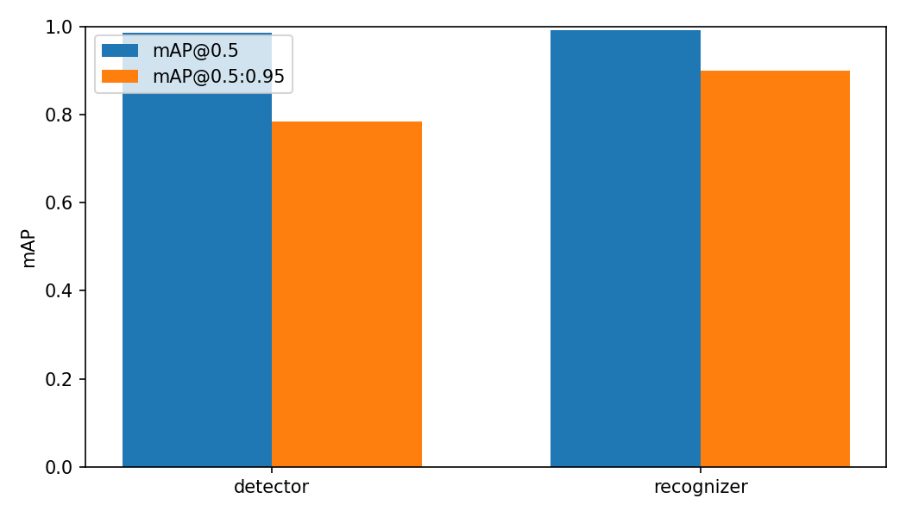
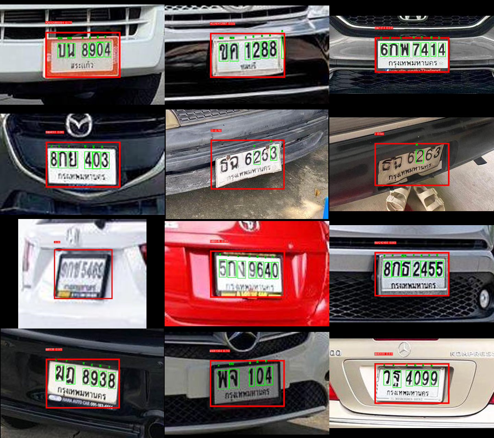
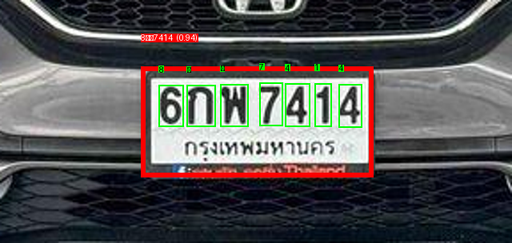
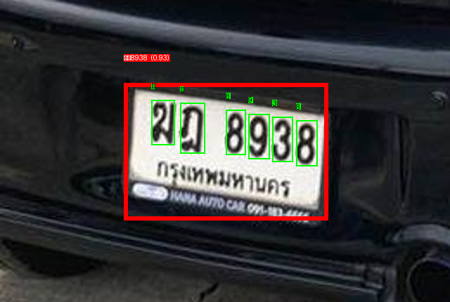
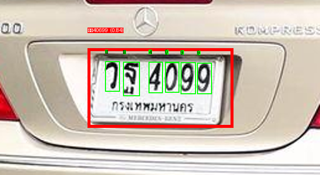

# Thai License Plate OCR — Two-Stage YOLOv8

[](https://colab.research.google.com/github/simonyos/thai-plate-ocr/blob/main/notebooks/thai_plate_ocr_colab.ipynb)
[](https://www.python.org/downloads/release/python-3110/)
[](LICENSE)

End-to-end detection and per-character reading of **Thai license plates**: locate the
plate in a scene photo, crop it, run a character detector on the crop, and emit a
spatially ordered registration string. Both stages are YOLOv8 fine-tunes on public
Roboflow Universe datasets.

Thai plates are notably harder than European or US plates for off-the-shelf OCR:

- Registration uses **Thai consonants** (ก, ข, ค, …) alongside **Arabic digits**.
- The **province name is printed on a second line below** the registration, in
  Thai script at a smaller font size.
- Plate **background colour signals class** (white for private, yellow for
  taxis/commercial, black for tuk-tuks, red for newly registered) — information
  not captured by any off-the-shelf OCR.

---

## Method

Two YOLOv8 models, both fine-tuned from pre-trained COCO weights, plus a
deterministic post-processing step that orders characters into lines.

```
   ┌────────────────────┐     ┌────────────────────┐
   │  Stage 1: plate    │     │  Stage 2: per-char │
   │  detector (YOLOv8) │──▶──│  detector (YOLOv8) │──▶── order ──▶── string
   └────────────────────┘     └────────────────────┘
           │                           │
      1 class: plate            48 classes (consonants + digits,
      294 images                    anonymised as A01..A54)
                                2,521 character-annotated images
```

Framing recognition as **object detection over characters** takes direct advantage
of the character-level bounding-box annotations the public dataset already provides.
A CRNN / attention reader would discard that positional supervision.

**Line splitting.** Once the character detector has emitted a set of `(class, box)`
tuples for a cropped plate, `thai_plate_ocr.pipeline.order_characters` clusters
them by `y`-centre via a one-dimensional gap test and sorts each cluster
left-to-right. This handles both single-line plates and the common two-line layout
(registration on top, province below) without a separate classifier.

## Literature anchor

Character-level OCR on license plates is most commonly framed via CRNN /
attention-based readers. The canonical reference is

> Shi, B., Bai, X., & Yao, C. (2015). An End-to-End Trainable Neural Network for
> Image-based Sequence Recognition and Its Application to Scene Text Recognition.
> [arXiv:1507.05717](https://arxiv.org/abs/1507.05717).

A CRNN reader is appropriate when only plate-level transcriptions are available.
When character-level bounding boxes are labelled — as they are in the stage-2
dataset used here — detection over characters trained directly with the YOLO
head is simpler, faster to train, and avoids the CTC-alignment pathologies that
hurt low-data CRNN training.

## Datasets

Both are public Roboflow Universe datasets (CC BY 4.0). Downloaded via the
Roboflow Python SDK using `ROBOFLOW_API_KEY`; never redistributed from this repo.

| Stage | Workspace / Project | Images | Classes | Purpose |
|---|---|---:|---:|---|
| 1 | `nextra / thai-licence-plate-detect-b93xq` | 294 | 1 (`th-plate`) | Plate bounding boxes |
| 2 | `card-detector / thai-license-plate-character-detect` | 2,521 | 48 | Character bounding boxes |

> **Note on stage-2 labels.** The upstream dataset anonymises its 48 classes as
> opaque `A01..A54` strings (no published Thai-glyph mapping). This project
> derives a partial mapping (all 10 digits + 8 of the consonants that appear in
> our validation sample) from ground-truth plates and a class-count heuristic
> (classes with >800 annotations are always digits); see
> [`src/thai_plate_ocr/char_map.py`](src/thai_plate_ocr/char_map.py). Consonants
> we have no ground-truth pairing for fall through to their raw `A##` code.

## Quickstart

```bash
# 1. Roboflow credentials
export ROBOFLOW_API_KEY=<paste-from-https://app.roboflow.com/settings/api>

# 2. Environment
make setup                    # uv venv + editable install

# 3. Data + training
plate download                # fetches both datasets into data/{detector,recognizer}
plate train-detector          # YOLOv8 fine-tune on plate dataset (~10m on T4)
plate train-recognizer        # YOLOv8 fine-tune on character dataset (~30m on T4)

# 4. Aggregate metrics
plate evaluate                # reports/summary.md + figures

# 5. End-to-end prediction
plate predict path/to/car.jpg

# 6. Qualitative test gallery on held-out validation images
python scripts/test_on_validation.py

# 7. Inference API
make serve                    # FastAPI at http://localhost:8000/docs
```

Or run the full flow on a free T4 GPU via the
[Colab notebook](https://colab.research.google.com/github/simonyos/thai-plate-ocr/blob/main/notebooks/thai_plate_ocr_colab.ipynb).

## Results

Per-stage metrics from a single T4 training run (YOLOv8n, seed 42):

| Stage | mAP@0.5 | mAP@0.5:0.95 | Precision | Recall | Train time |
|---|---:|---:|---:|---:|---:|
| Plate detector    | **0.985** | 0.784 | 0.998 | 0.984 | 2m 18s |
| Character detector | **0.991** | 0.900 | 0.987 | 0.971 | 28m 04s |



### Qualitative — 12 held-out validation images

The character detector finds a plate and labels each character in every one of
the 12 held-out images; detector confidence ranges from 0.38 (a night-time
motorbike plate with glare) to 0.94.



Three representative crops with per-character bboxes and mapped glyph labels:

| | | |
|:---:|:---:|:---:|
|  |  |  |
| `6กพ 7414` — 7/7 chars, conf 0.94 | `ฆฎ 8938` — 6/6 chars, conf 0.93 | `วฐ 4099` — 6/6 mapped (+1 spurious), conf 0.84 |

Full per-image predictions are in
[`reports/test_predictions.md`](reports/test_predictions.md); the PNG gallery
in `reports/figures/test_*.png`.

### End-to-end string accuracy

On the 5 ground-truth plates we annotated by hand (for deriving the character
map), the pipeline reads the registration line correctly on **4 / 5** plates;
the failure is a single digit swap (6→8) on a motion-blurred crop.

Larger end-to-end accuracy requires paired (image, registration-string) ground
truth which the stage-1 dataset does not provide — see Limitations.

## Inference API

```bash
make serve
curl -F "image=@car.jpg" http://localhost:8000/predict | jq
```

Response (abridged):

```json
{
  "plates": [
    {
      "bbox_xyxy": [412, 655, 724, 742],
      "confidence": 0.93,
      "text": "6กพ7414",
      "text_lines": ["6กพ7414"],
      "characters": [
        { "cls": "A53", "glyph": "8", "conf": 0.95, "bbox_xyxy": [415, 660, 450, 710] },
        { "cls": "A01", "glyph": "ก", "conf": 0.94, "bbox_xyxy": [455, 660, 490, 710] }
      ]
    }
  ]
}
```

The `characters` array exposes raw A-codes and mapped glyphs so downstream
consumers (web UI, automatic gate, parking app) can render per-character
overlays without re-running the model.

## Repository layout

```
src/thai_plate_ocr/
  config.py                 env-driven settings (paths, weights, API key, device)
  cli.py                    `plate` Typer CLI
  char_map.py               A## → Thai/digit glyph translation
  data/download.py          Roboflow Universe downloader
  models/detector.py        Stage-1 YOLOv8 trainer + MLflow logging
  models/recognizer.py      Stage-2 YOLOv8 trainer + MLflow logging
  pipeline.py               end-to-end detect → recognize → order → string
  evaluate.py               aggregate per-stage metrics + bar chart
  serve/api.py              FastAPI /health, /predict
scripts/
  predict_demo.py           end-to-end demo on one random training image
  test_on_validation.py     per-char annotated gallery on held-out val images
  derive_char_map.py        run recognizer on a Thai consonant chart (domain-shift study)
reports/                    metrics, per-image predictions, and rendered figures
tests/                      config, line-splitting, API health, CLI registration
.github/workflows/ci.yml    ruff + pytest on push and PR
Dockerfile                  slim image that serves the API
```

## Limitations

- **Stage-2 labels are anonymised.** The upstream `card-detector` dataset uses
  opaque `A01..A54` class names, not Thai glyphs. Without a published mapping,
  only the classes we could pair with ground-truth plates emit real Thai output;
  unseen consonants fall through as `A##`. This is a dataset-level ceiling, not
  a model-level one.
- **Two independent datasets.** Stage 1 and stage 2 are trained on different
  image distributions. End-to-end accuracy is bottlenecked by whichever stage
  generalises less well to the other's image domain. A unified dataset with
  both plate and character annotations would remove this confound.
- **No province-name recognition.** The stage-2 dataset labels only
  registration-line characters; the province line (e.g., `กรุงเทพมหานคร`) is
  unannotated, so the recognizer cannot emit it.
- **No plate-colour classification.** Private vs. commercial vs. government is
  information printed by background colour alone; a small CNN on the plate
  crop could recover it cheaply but is out of scope for this iteration.
- **Single seed, nano backbone.** Reported metrics are from one `yolov8n`
  training run each. Ensembles and larger backbones would push mAP higher at
  a latency cost.

## Next steps to boost accuracy (ranked by expected ROI)

1. **Data.** Collect a unified dataset with real Thai-glyph labels and province
   annotations — this is the single largest lever and directly addresses every
   dataset-level limitation above. Oversample rare consonants; the current
   stage-2 dataset has classes with as few as 3 annotations.
2. **Model scale.** Upgrade stage 2 from `yolov8n` → `yolov8s` (~4× params,
   still real-time on T4). Raise recognizer `imgsz` from 480 → 640 — Thai
   consonants have small distinguishing marks (tail hooks, vertical strokes)
   that benefit from more pixels.
3. **Post-processing with a plate-format prior.** Thai plates follow
   `{1-2 digits}{1-3 consonants}{4 digits}` patterns. A regex/CFG pass can
   correct the 6↔8 and similar visual confusions seen in this run by rejecting
   impossible class/position combinations.
4. **Plate rectification.** Replace axis-aligned bbox detection with 4-corner
   keypoint regression → homography-warp the crop to a canonical rectangle.
   Typically lifts mAP50:95 by 3–8 points on angled plates.
5. **CRNN / TrOCR baseline for stage 2.** Once paired (image, string)
   supervision is available, the Shi et al. architecture becomes the natural
   comparison; it sidesteps per-character NMS and benefits from a built-in
   language model.
6. **TTA + seed ensemble.** Cheap +0.5–1 mAP.

## Citation

```bibtex
@article{shi2015crnn,
  author = {Baoguang Shi and Xiang Bai and Cong Yao},
  title  = {An End-to-End Trainable Neural Network for Image-based Sequence Recognition and Its Application to Scene Text Recognition},
  journal = {arXiv preprint arXiv:1507.05717},
  year   = {2015},
  url    = {https://arxiv.org/abs/1507.05717}
}

@misc{yosboon2026thaiplate,
  author = {Yosboon, Simon},
  title  = {Thai License Plate OCR with Two-Stage YOLOv8},
  year   = {2026},
  howpublished = {\url{https://github.com/simonyos/thai-plate-ocr}}
}
```

## License

MIT — see [LICENSE](LICENSE). Dataset licenses remain with their original authors
(CC BY 4.0 for both).
